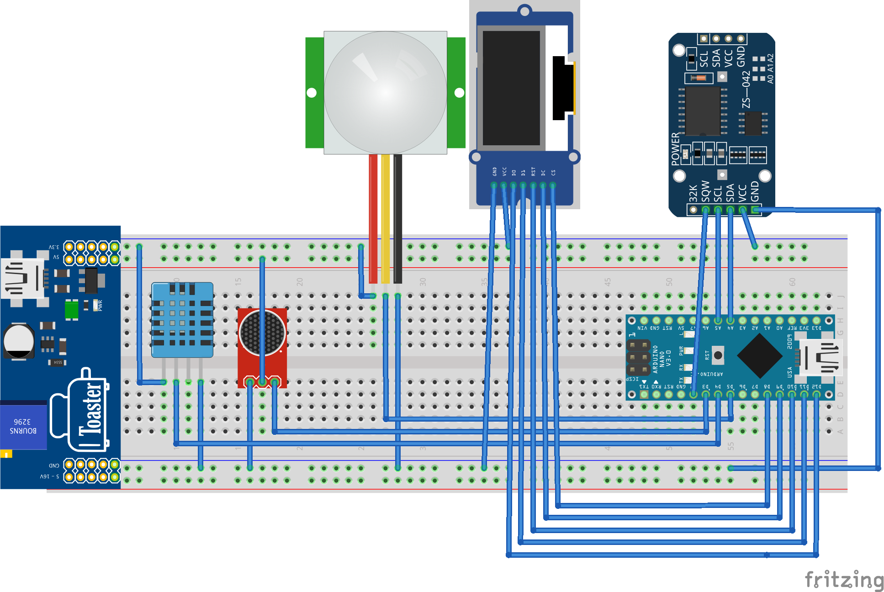

# Arduino-RTC-Interrupt
Arduino RTC external interrupt and pin change interrupt driven programming using a PIR motion sensor, sound detection sensor and DHT11

Fritzing Diagram
-----------------

Overview
--------
The Arduino nano has 2 external interrupts, INT0 (pin 2) and INT1 (pin 3) and 24 pin change interrupts.  For this project I have used both of the external interrupts and a pin change interrupt to gather sensor data.

The project involves displaying the current time read from the DS3231 Real Time Clock module.  To read the current time, I have used DS3231AlarmOne which is configured to trigger every second.  This is the built in alarm on the DS3231 module, which you can set in your program. DS3231AlarmTwo is attached to a trigger once a minute.  

Arduino PIN 2 (INT0)
--------------------
The DS3231 RTC is wired to Arduino pin 2 where I have attached an interrupt handler on the falling edge of the pulse.  So this Arduino pin 2 will be triggered every second as well as on the minute.  When the clock interrupt is called, the interrupt handler routine (ISR) just sets a flag to true.  It is the job of the main loop to determine if this flag is set and to further determine whether it is DS3231AlarmFlag_Alarm1 or DS3231AlarmFlag_Alarm2 that has triggered.

When the DS3231AlarmFlag_Alarm1 is triggered I read the current time from the RTC ready to be displayed on the OLED module.  When the DS3231AlarmFlag_Alarm2 is triggered I get the temperature and humidity from the DHT11 module ready to be displayed on the OLED module.

Arduino PIN 3 (INT1)
--------------------
The digital output of the Sounds Sensor module is connected to Arduino pin 3.  So when the sound sensor triggers a change, interrupt 1 is activated, where the ISR sets the currentt sensor state as the not of the previous state.  In the main loop of the program I display the current sound sensor state via turning the built in LED on or off.

PIR sensor PIN 5 (Pin Change Interrupt 21 - PCINT21)
----------------------------------------------------
